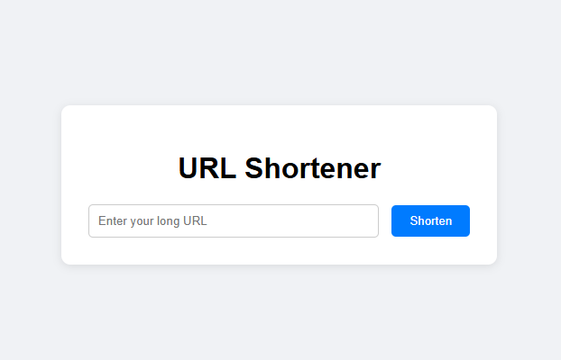

# URL Shortener

A simple Flask-based URL Shortener that allows users to convert long URLs into short, shareable links. Fully compatible with **Vercel deployment** and includes **CI/CD setup** using GitHub Actions.

## Demo



---

## Features

- Shorten long URLs to compact, easy-to-share links  
- Redirect short URLs to the original long URLs  
- In-memory storage for quick demo (serverless-friendly)  
- Fully compatible with **Vercel** deployment  
- Optional: CI setup with **GitHub Actions** for automatic testing  

---

## Tech Stack

- **Backend:** Python, Flask  
- **Frontend:** HTML, CSS (Jinja2 templates)  
- **Deployment:** Vercel (Serverless Python Runtime)  
- **CI/CD:** GitHub Actions  

---

## Project Structure

```
url-shortener/
│
├── app.py                 # Main Flask application
├── requirements.txt       # Python dependencies
├── vercel.json            # Vercel deployment config
├── templates/
│   └── index.html         # Main HTML template
├── static/
│   └── style.css          # Optional styling
├── tests/
│   └── test_app.py        # CI tests (optional)
└── .github/
    └── workflows/
        └── ci.yml         # GitHub Actions workflow
```


---

## Installation & Local Setup

1. Clone the repository:

```bash
git clone https://github.com/yourusername/URL-Shortener.git
cd URL-Shortener
```
2. Create a virtual environment (optional but recommended):
```
python -m venv venv
source venv/bin/activate   # Linux/Mac
venv\Scripts\activate      # Windows
```
3. Install dependencies:
```
pip install -r requirements.txt
```
5. Run the app locally:
```
python app.py
```
6. Open http://127.0.0.1:5000  in your browser
